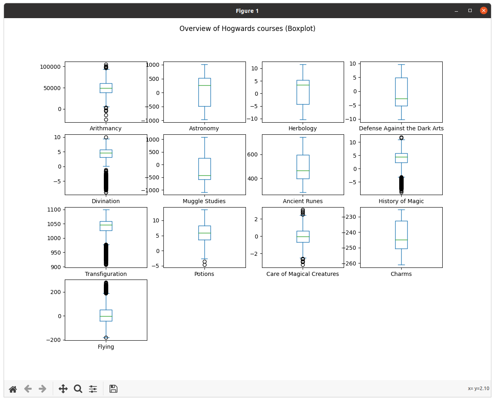

# Datascience X Logistic Regression (DSLR)

<!-- ```diff
- The project is still ongoing. Daily updates into the contents.
``` -->

## 1. Project overview

The project is part of my studying at [Hive (Helsinki) Coding School](https://hive.fi). Programs are written in C-, and python- languages. An additional visualization (Bonus part of the project) I used Influxdb and Grafana which are running inside a docker container. For learning and testing purposes I used a Jupyter notebook. The picture below visualizes a general overview of projects at Hive (Helsinki) Coding School.


## 2. Project description

**Note.** Text into this chapter (project description) was copied (partly or fully) from Hive Coding School document.

### 2.1 Introduction

On no! Since its creation, the famous school of wizards, Hogwarts, had never known such an offense. The forces of evil have bewitched the Sorting Hat. It no longer responds, and is unable to fulfill his role of sorting the students to the houses. The new academic year is approaching. Gladly, the Professor McGonagall was able to take action in such a stressful situation, since it is impossible for Hogwarts not to welcome new students. . . She decided to call on you, a muggle "datascientist" who is able to create miracles with the tool which all muggles know how to use: a "computer". Despite the intrinsic reluctance of many wizards, the director of the school welcomes you to his office to explain the situation. You are here because his informant discovered that you are able to recreate a magic Sorting Hat using your muggle tools. You explain to him that in order for your "muggle" tools to work, you need students data. Hesitantly, Professor McGonagall gives you a dusty spellbook. Fortunately for you, a simple "Digitalis!" and the book turned into a USB stick.

### 2.2 Objectives

In this project DataScience x Logistic Regression, you will continue your exploration of Machine Learning by discovering different tools. The use of the term DataScience in the title will be clearly considered by some to be abusive. That is true. We do not pretend to give you all the basics of DataScience in this topic. The subject is vast. We will only see here some bases which seemed to us useful for data exploration before sending it to the machine learning algorithm . You will implement a linear classification model, as a continuation of the subject linear regression : a logistic regression. We also encourage you a lot to create a machine learning toolkit while you will move along the branch.

**Summarizing**

- You will learn how to read a data set, to visualize it in different ways, to select and clean unnecessary information from your data.
- You will train a logistic regression that will solve classification problem.

### 2.3 Formulas for calculation

Logistic regression works almost like the linear regression. Here is a cost (loss) function:

=-\frac{1}{m}\sum_{i=1}^{m}y^ilog(h_\theta(x^i))+(1-y^i)log(1-h_\theta(x^i)))

Where hθ(x) is defined in the following way:

=g(\theta^{T}x))

With:

=\frac{1}{1+e^{-z}})

The loss function gives us the following partial derivative:

-y^i)x^i_j)

## 5. Solution

Required functions are implemented with python and C languages. Visualization functions are implemented with python (numpy module) and logistic regression functionality with c language. Program/scripts are command-line based (requires terminal app in MAC-OS). Additional bonus functionalities are implemented with influxdb/grafana applications. Those are running in docker containers. make file is used for compiling C-program and setting up docker containers.

### 5.1 Solution overview

#### 5.1.1 Implemented neural network model


#### 5.1.2 Data flow


### 5.2 A content of input files

An input files are csv formatted files. dataset_train file includes examples which are supposed to use for learning phase and dataset_test file includes examples which are supposed to use for verification of accuracy of a solution.
Main differences between the files are the column "Hogwarts House" and number of examples. The column is empty in tet file and main purpose is to predict right house name.

#### 5.2.1 A content of the dataset_train.csv file

Index|Hogwarts House|First Name|Last Name|Birthday|Best Hand|Arithmancy|Astronomy|Herbology|Defense Against the Dark Arts|Divination|Muggle Studies|Ancient Runes|History of Magic|Transfiguration|Potions|Care of Magical Creatures|Charms|Flying
|-|-|-|-|-|-|-|-|-|-|-|-|-|-|-|-|-|-|-|
0|Ravenclaw|Tamara|Hsu|2000-03-30|Left|58384.0|-487.88608595139016|5.727180298550763|4.8788608595139005|4.7219999999999995|272.0358314131986|532.4842261151226|5.231058287281048|1039.7882807428462|3.7903690663529614|0.7159391270136213|-232.79405|-26.89
1|Slytherin|Erich|Paredes|1999-10-14|Right|67239.0|-552.0605073421984|-5.987445780050746|5.520605073421985|-5.612|-487.3405572673422|367.7603030171392|4.107170286816076|1058.9445920642218|7.248741976146588|0.091674183916857|-252.18425|-113.45
2|Ravenclaw|Stephany|Braun|1999-11-03|Left|23702.0|-366.0761168823237|7.7250166064392305|3.6607611688232367|6.14|664.8935212343011|602.5852838484592|3.5555789956034967|1088.0883479121803|8.728530920939827|-0.5153268462809037|-227.34265|30.42
|:
1597|Gryffindor|Benjamin|Christensen|1999-10-24|Right|63905.0|544.0189245796867|-3.2032693227535702|-5.440189245796868|6.065|-385.1504571363952|635.211486238971|-5.984256502991308|953.8666846765262|1.7098082213145225|0.07156922598115|-251.63679|198.47
1598|Hufflepuff|Charlotte|Dillon|2001-09-21|Left|82713.0|453.67621879773833|3.4428308795056126|-4.536762187977383|6.7379999999999995|-831.7411229104907|383.4449369721156|3.813110939661641|1087.9492046157993|3.904100126070952|-0.5318749751118403|-246.19072000000003|-76.81
1599|Hufflepuff|Kylie|Nowak|2000-08-21|Left|48639.0|688.9119887739912|5.4210456374755775|-6.8891198877399145|6.593|-234.20791091534042|339.7751540064821|7.208415443067706|1034.9280038756551|2.0522148736362857|0.15053170994920334|-244.02062999999998|-54.77

#### 5.2.2 A content of the dataset_test.csv file

Index|Hogwarts House|First Name|Last Name|Birthday|Best Hand|Arithmancy|Astronomy|Herbology|Defense Against the Dark Arts|Divination|Muggle Studies|Ancient Runes|History of Magic|Transfiguration|Potions|Care of Magical Creatures|Charms|Flying
|-|-|-|-|-|-|-|-|-|-|-|-|-|-|-|-|-|-|-|
0||Rico|Sargent|2001-10-06|Right|41642.0|696.0960714808824|3.0201723778093963|-6.960960714808824|7.996|-365.1518504531068|393.13818539298967|4.207690767250213|1046.7427360602487|3.6689832316813447|0.3738525472517433|-244.48172|-13.62
1||Tamara|Shackelford|1998-01-08|Left|45352.0|-370.8446553065122|2.9652261693057698|3.708446553065121|6.349|522.5804860261724|602.8530505526203|6.460017331082373|1048.0538781192083|8.51462223474569|0.5774322733924575|-231.292|-26.26
2||Staci|Crandall|1998-09-15|Left|43502.0|320.3039904202326|-6.1856965870805025|-3.2030399042023268|4.619|-630.0732069461911|588.0717953227543|-5.565818052162058|936.4373579469948|1.8508293300849623|-1.6471500089738849|-252.99343|200.15
|:
397||Eugene|Peralta|1998-11-14|Right|61982.0|292.10873793536615|5.234529833477609|-2.9210873793536623|4.23|-787.0360495302342|433.25996704442366|3.8981597040978686|1069.794110139911|6.495579301439053|-2.2865373952165613|-244.01333|1.25
398||Allan|Bentley|1998-10-13|Left|56020.0|-726.4185525505127|6.735581859032765|7.264185525505128|3.908|511.96076203579423|613.3915138181925|7.244499044719727|1042.0588039563484|7.55425928165166|-0.7888166399316436|-228.2429|-18.27
399||Clarence|Pope|1999-07-26|Left|46452.0|-735.9397268421982|7.2248717723158125||2.889||513.4574699130203|3.0959424053982607|1035.3315888513016|0.477165323160548|0.9756274005072034|-230.70067000000003|-8.78

#### 5.2.3 Weight and Bias values

|WEIGHT||||||||||||||
|-|-|-|-|-|-|-|-|-|-|-|-|-|-|
|0: | -0.033607 | -0.020747 | -0.041620 | -0.038394 | -0.033425 | -0.028520 | -0.033020 | -0.048395 | -0.057123 | -0.040747 | -0.030820 | -0.005468 | -0.011289|
1: | -0.025374 | -0.036856 | -0.013665 | -0.007739 | -0.022772 | -0.000132 | -0.021348 | -0.020156 | -0.040012 | -0.022582 | -0.022362 | -0.000414 | -0.022830|
2: | -0.035239 | -0.041575 | -0.042451 | -0.020816 | -0.054756 | -0.029151 | -0.045310 | -0.031760 | -0.056925 | -0.029002 | -0.032127 | -0.005119 | -0.035091|
3: | -0.018595 | -0.002261 | -0.006453 | -0.031709 | -0.014896 | -0.021762 | -0.030428 | -0.012876 | -0.029425 | -0.023234 | -0.017091 | -0.002540 | -0.019133|

|BIAS||
|-|-|
0: | -0.059125
1: | -0.044625
2: | -0.062375
3: | -0.033875

### 5.2.4 Predicted values in house.csv file

|index|Hogwards house|
|-|-|
0|Hufflepuff
1|Slytherin
2|Hufflepuff
|:
10|Ravenclaw
11|Slytherin
12|Gryffindor
|:

### 5.2 Visualization

#### 5.2.1 Describe


#### 5.2.2 Box plot

Boxplot visualizes functions (values of them) so that it's easy to get an overview of functions. In the picture below we see that some functions include values that are not within common (Q1 and Q3) limits. To avoid unexpected behavior during data processing the content of those functions requires deeper analysis.



#### 5.2.3 Correlations plot

Correction plot visualizes correlation between functions. Functions that correlate strongly do not add additional value for data processing. In case of limitation of the amount of input data is required, selecting just one of the functions that correlate each other might be a valid solution. The correlation could be the same or opposite direction. In the picture below the yellow and the purple colors indicate a strong correlation between functions.


#### 5.2.4 Histogram plot

Histogram plots visualize how values in a function are distributed. Currently, I do not have any idea how this information could be useful for data processing. Let see do I get some ideas in the future.


#### 5.2.5 Scatter plot

A scatter plot and correlation plot visualizes similar things (at least from my point of view). The visualization view is different that makes the possibility for a different kind of information. Currently, I don't know what kind of, but in any case.


#### 5.2.6 Cost


### 5.3 Implemented Matrix and Vector calculation funtions

To learn (all details) I decided to write logistic regression functionality with C-language. It's a lot of work and forces me to really understand how details must be implemented. Looking forward that this kind of way of learning helps me to use ready-made functionality (like in numpy, pandas etc...) fluently.
Below, is a list of matrix/vector functions that I wrote.

| Name of the function | similar functionality in python
|:-|:-|
| ft_double_div_vector.c | [numpy.divide](https://numpy.org/doc/stable/reference/generated/numpy.divide.html?highlight=div#numpy.divide) |
| ft_double_subtract_matrix.c | [numpy.subtract](https://numpy.org/doc/stable/reference/generated/numpy.subtract.html?highlight=subtract) |
| ft_matrix_add_double.c | [numpy.add](https://numpy.org/doc/stable/reference/generated/numpy.add.html?highlight=add#numpy.add) |
| ft_matrix_add_matrix.c | [numpy.add](https://numpy.org/doc/stable/reference/generated/numpy.add.html?highlight=add#numpy.add) |
| ft_matrix_add_vector.c | [numpy.add](https://numpy.org/doc/stable/reference/generated/numpy.add.html?highlight=add#numpy.add) |
| ft_matrix_div_vector.c | [numpy.divide](https://numpy.org/doc/stable/reference/generated/numpy.divide.html?highlight=div#numpy.divide) |
| ft_matrix_dot_matrix.c | [nympy.dot](https://numpy.org/doc/stable/reference/generated/numpy.dot.html) |
| ft_matrix_dot_vector_double.c | [nympy.dot](https://numpy.org/doc/stable/reference/generated/numpy.dot.html) |
| ft_matrix_exp_double.c | [numpy.exp](https://numpy.org/doc/stable/reference/generated/numpy.exp.html) |
| ft_matrix_log.c | [numpy.log](https://numpy.org/doc/stable/reference/generated/numpy.log.html) |
| ft_matrix_max.c | [numpy.matrix.max](https://numpy.org/doc/stable/reference/generated/numpy.matrix.max.html?highlight=max#numpy.matrix.max) |
| ft_matrix_min.c | [numpy.matrix.min](https://numpy.org/doc/stable/reference/generated/numpy.matrix.min.html?highlight=min#numpy.matrix.min) |
| ft_matrix_multiply_matrix.c | [numpy.multiply](https://numpy.org/doc/stable/reference/generated/numpy.multiply.html) |
| ft_matrix_subtract_matrix.c | [numpy.subtract](https://numpy.org/doc/stable/reference/generated/numpy.subtract.html?highlight=subtract) |
| ft_matrix_subtract_vector.c | [numpy.subtract](https://numpy.org/doc/stable/reference/generated/numpy.subtract.html?highlight=subtract) |
| ft_matrix_sum.c | [numpy.sum](https://numpy.org/doc/stable/reference/generated/numpy.sum.html) |
| ft_matrix_transpose.c | [numpy.transpose](https://numpy.org/doc/stable/reference/generated/numpy.transpose.html?highlight=transpose#numpy.transpose) |
| ft_vector_abs_double.c | [numpy.absolute](https://numpy.org/doc/stable/reference/generated/numpy.absolute.html?highlight=abs#numpy.absolute) |
| ft_vector_add_double.c | [numpy.add](https://numpy.org/doc/stable/reference/generated/numpy.add.html?highlight=add#numpy.add) |
| ft_vector_add_vector.c | [numpy.add](https://numpy.org/doc/stable/reference/generated/numpy.add.html?highlight=add#numpy.add) |
| ft_vector_div_double.c | [numpy.divide](https://numpy.org/doc/stable/reference/generated/numpy.divide.html?highlight=div#numpy.divide) |
| ft_vector_transpose.c | [numpy.transpose](https://numpy.org/doc/stable/reference/generated/numpy.transpose.html?highlight=transpose#numpy.transpose) |

### 5.4 Implemented activation functions

| Name of the function | equation |
|:-|:-|
| ft_sigmoid.c | =\frac{1}{1+e^{-z}}) |

### 5.5 Implemented gradient descent functions

| Name of the function | equation |
|:-|:-|
| loss.c | ) |
| update_weight_and_bias | <br> |
| cost_recalculate | =-\frac{1}{m}\sum_{i=1}^{m}y^{obs}log(y^{pred})+(1-y^{obs})log(1-y^{pred}))|
|linear_calculation|  |

### 5.6 Implemented command line arguments

#### 5.6.1 Optional arguments

| Argument | Description |
| :-: | - |
| -A \<learning rate\> | Learning rate for gradient descent calculations (backward propagation) |
| -I \<number of itetation loops\> | Number of iteration loops |
| -S | Send (statistical) data to influx database |
| -h | Help printout |
| -l | Print leaks, if any. Only in MAC-OS |

#### 5.6.2 Mandatory arguments

| Argument | Description |
| :- | - |
| \<mode\> | The mode specify contnet of an input file.<br>TRAIN --> Training examples<br>TEXT --> Test examples|
| \<input_file\> | A file includes either learning or test examples |
