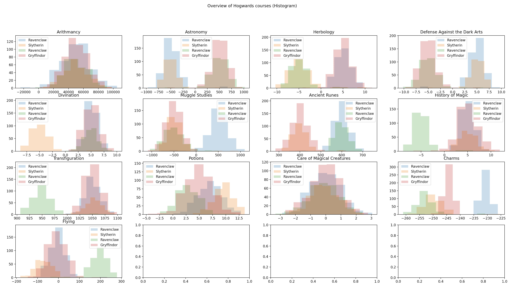

# Datascience X Logistic Regression (DSLR)

## 1. Project description

### 1.1 Formulas for calculation

=\frac{1}{1+e^{-z})

=-\frac{1}{m}\sum_{i=1}^{m}y^ilog(h_\theta(x^i))+(1-y^i)log(1-h_\theta(x^i)))

## 5. Solution

### 5.1 Solution description

### 5.x Visualization

#### 5.x.x Describe

#### 5.x.x Box plot

Boxplot visualize functions (values of them) so that its easy to get overview about functions. In the picture below we see that some functions includes values which are not in common limits. To avoid unexpected behavier during data processing a content of those functions requires deeper analysis.

#### 5.x.x Correlations plot

Correction plot visualize correlation between functions. Functions which correlate strongly does not add additional value for data processing. In case of limitation of amount of a input data is required, selecting just one of functions which correlate each other might be valid solution. Correlation could be same or opposite direction. In the picture below yellow and purple colours indicate strong correlation between functions.

#### 5.x.x Histogram plot

Histogram plot visualize how values in a function are distributed. Currently I do not have any idea how this information could be usefull for data processing. Let see do I get some ideas in future.

#### 5.x.x Scatter plot

### 5.2 Implemented Matrix and Vector calculation funtions

| Name of the function | similar functionality in python
|:-|:-|
| ft_double_div_vector.c | [numpy.divide](https://numpy.org/doc/stable/reference/generated/numpy.divide.html?highlight=div#numpy.divide) |
| ft_double_subtract_matrix.c | [numpy.subtract](https://numpy.org/doc/stable/reference/generated/numpy.subtract.html?highlight=subtract) |
| ft_matrix_add_double.c | [numpy.add](https://numpy.org/doc/stable/reference/generated/numpy.add.html?highlight=add#numpy.add) |
| ft_matrix_add_matrix.c | [numpy.add](https://numpy.org/doc/stable/reference/generated/numpy.add.html?highlight=add#numpy.add) |
| ft_matrix_add_vector.c | [numpy.add](https://numpy.org/doc/stable/reference/generated/numpy.add.html?highlight=add#numpy.add) |
| ft_matrix_div_vector.c | [numpy.divide](https://numpy.org/doc/stable/reference/generated/numpy.divide.html?highlight=div#numpy.divide) |
| ft_matrix_dot_matrix.c | [nympy.dot](https://numpy.org/doc/stable/reference/generated/numpy.dot.html) |
| ft_matrix_dot_vector_double.c | [nympy.dot](https://numpy.org/doc/stable/reference/generated/numpy.dot.html) |
| ft_matrix_exp_double.c | [numpy.exp](https://numpy.org/doc/stable/reference/generated/numpy.exp.html) |
| ft_matrix_log.c | [numpy.log](https://numpy.org/doc/stable/reference/generated/numpy.log.html) |
| ft_matrix_max.c | [numpy.matrix.max](https://numpy.org/doc/stable/reference/generated/numpy.matrix.max.html?highlight=max#numpy.matrix.max) |
| ft_matrix_min.c | [numpy.matrix.min](https://numpy.org/doc/stable/reference/generated/numpy.matrix.min.html?highlight=min#numpy.matrix.min) |
| ft_matrix_multiply_matrix.c | [numpy.multiply](https://numpy.org/doc/stable/reference/generated/numpy.multiply.html) |
| ft_matrix_subtract_matrix.c | [numpy.subtract](https://numpy.org/doc/stable/reference/generated/numpy.subtract.html?highlight=subtract) |
| ft_matrix_subtract_vector.c | [numpy.subtract](https://numpy.org/doc/stable/reference/generated/numpy.subtract.html?highlight=subtract) |
| ft_matrix_sum.c | [numpy.sum](https://numpy.org/doc/stable/reference/generated/numpy.sum.html) |
| ft_matrix_transpose.c | [numpy.transpose](https://numpy.org/doc/stable/reference/generated/numpy.transpose.html?highlight=transpose#numpy.transpose) |
| ft_vector_abs_double.c | [numpy.absolute](https://numpy.org/doc/stable/reference/generated/numpy.absolute.html?highlight=abs#numpy.absolute) |
| ft_vector_add_double.c | [numpy.add](https://numpy.org/doc/stable/reference/generated/numpy.add.html?highlight=add#numpy.add) |
| ft_vector_add_vector.c | [numpy.add](https://numpy.org/doc/stable/reference/generated/numpy.add.html?highlight=add#numpy.add) |
| ft_vector_div_double.c | [numpy.divide](https://numpy.org/doc/stable/reference/generated/numpy.divide.html?highlight=div#numpy.divide) |
| ft_vector_transpose.c | [numpy.transpose](https://numpy.org/doc/stable/reference/generated/numpy.transpose.html?highlight=transpose#numpy.transpose) |

### 5.3 Implemented activation functions

### 5.4 Implemented gradient descent functions

### 5.6 Implemented command line arguments

#### 5.6.1 Optional arguments

| Argument | Description |
| :-: | - |
| -h | Help printout |
| -l | Print leaks, if any. Only in MAC-OS |

#### 5.6.2 Mandatory arguments

| Argument | Description |
| :- | - |
| \<mode\> | The mode specify contnet of an input file. The file may include either learning examples or test examples. L --> Training examples, T --> Test examples|
| \<input file\> | A file includes either learning or test examples |
